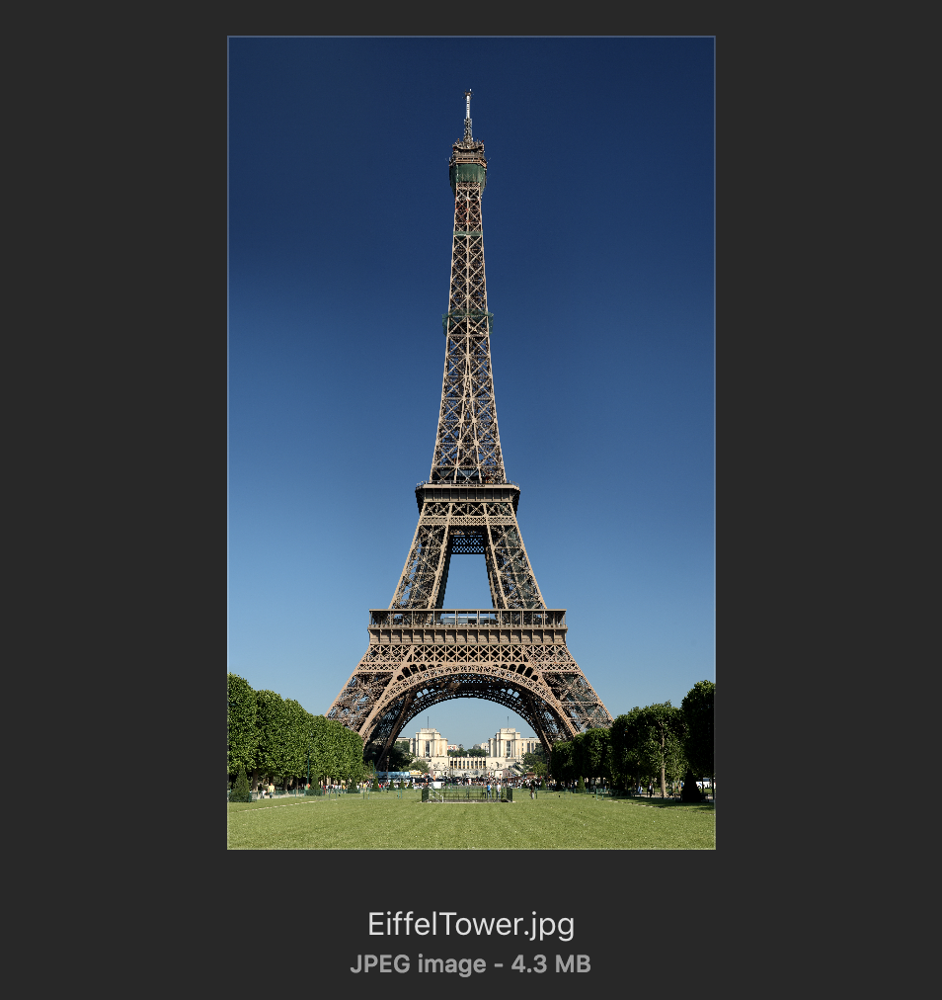
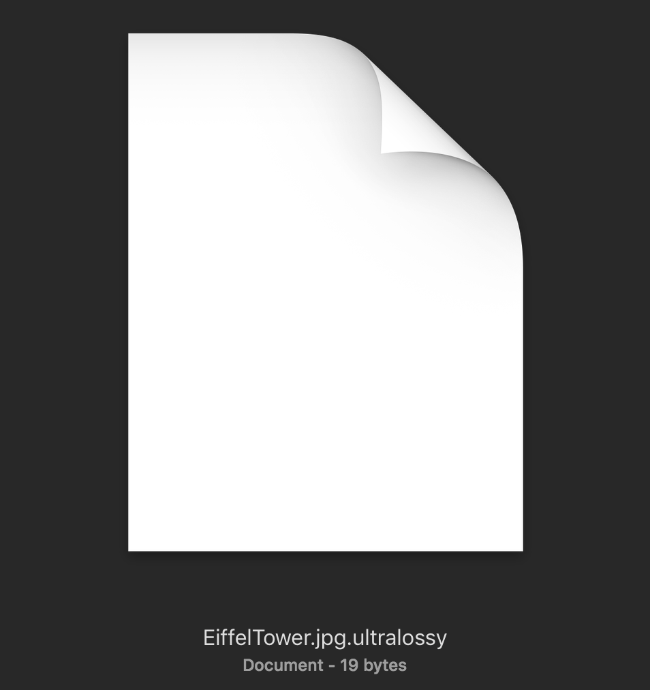
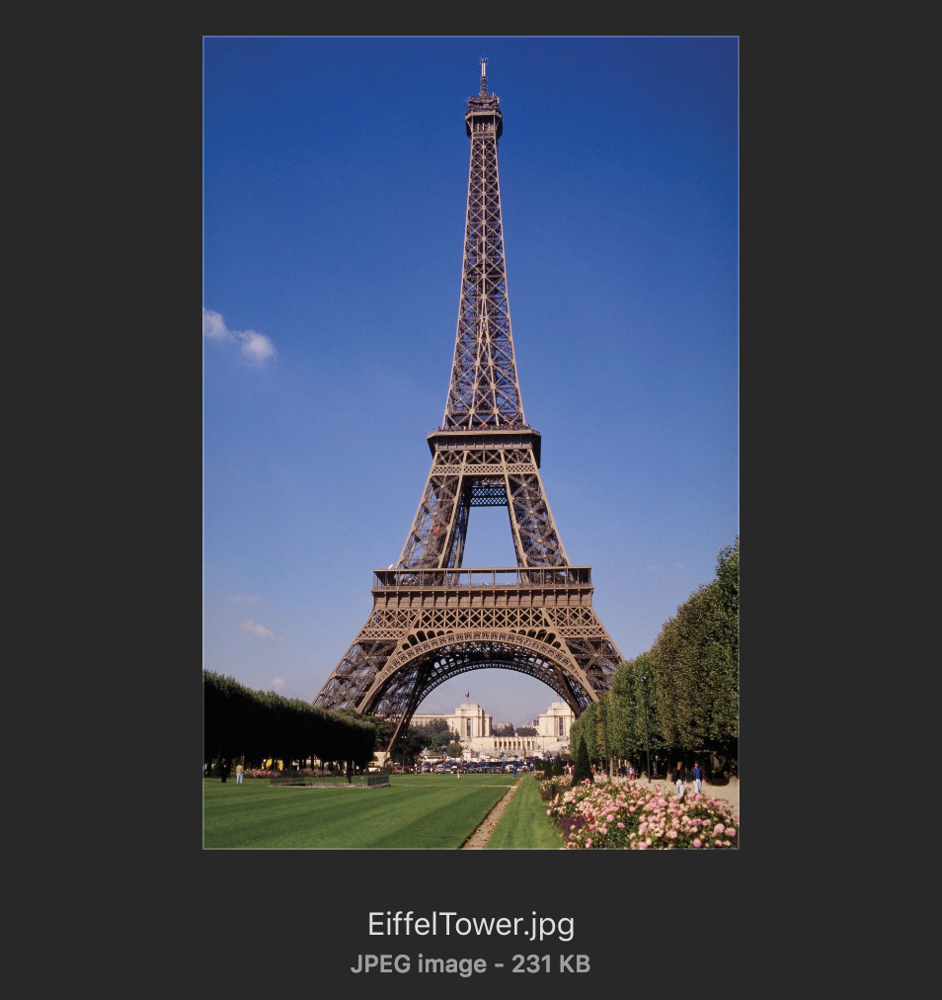

# UltraLossyCompression
The most powerful and useless compression for images 🤙🤙🤙

For example, compress a 4.3 MB photo to just 19 bytes. A size reduction of -99.999955% 😍😍😍

In some cases, resolution is actually **gained** when decompressing! 😱😱😱

Behold the following results:

### Before Compression:

### After Compression:

### After Decompression:

*Please note, this is a joke and not intended for any actual use*

*Actually "compressing" a photo will remove that photo, and replace it with a similar-ish version*
